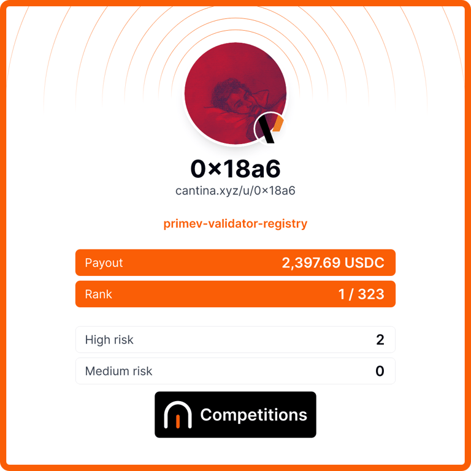

I'm a security researcher with multiple top place finishes in competitive audits:

| Competition                      | Place      | Findings | Tags | Leaderboard                                                                                     |
|----------------------------------|------------|----------|------|-------------------------------------------------------------------------------------------------|
| MEV Commit: Reward Manager       | 🏆 **1st**    | 2H       | `vault`, `solidity`     |[Cantina](https://cantina.xyz/code/e92be0b9-b4f2-4bf2-9544-ae285fcfc02d/overview/leaderboard)   |
| MEV Commit: Validator Registry   | 🏆 **1st**    | 1H       | `registry`, `solidity`     |[Cantina](https://cantina.xyz/competitions/217af22c-957e-4c13-bc2a-1d5255e72309/leaderboard)    |
| Reflector V3                     | 4th        | 1M       | `oracle`, `rust`     |[Code4rena](https://code4rena.com/audits/2025-10-reflector-v3)                                  |
| Injective                        | 5th        | 1H, 2M   | `chain`, `bridge`, `go`     |[Code4rena](https://code4rena.com/audits/2026-02-injective-peggy-bridge)                        |

Browse more of my audit work at: https://audits.sherlock.xyz/watson/x18a6.
